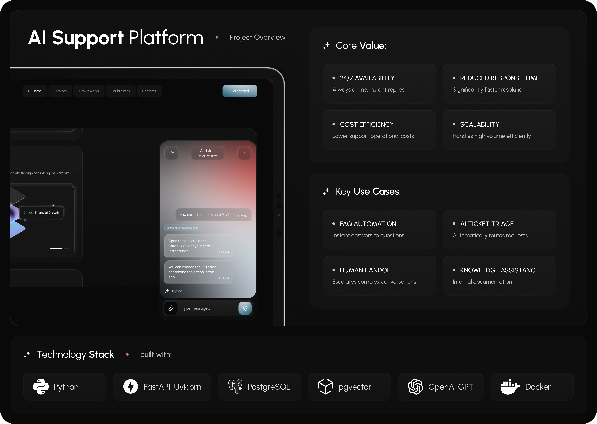
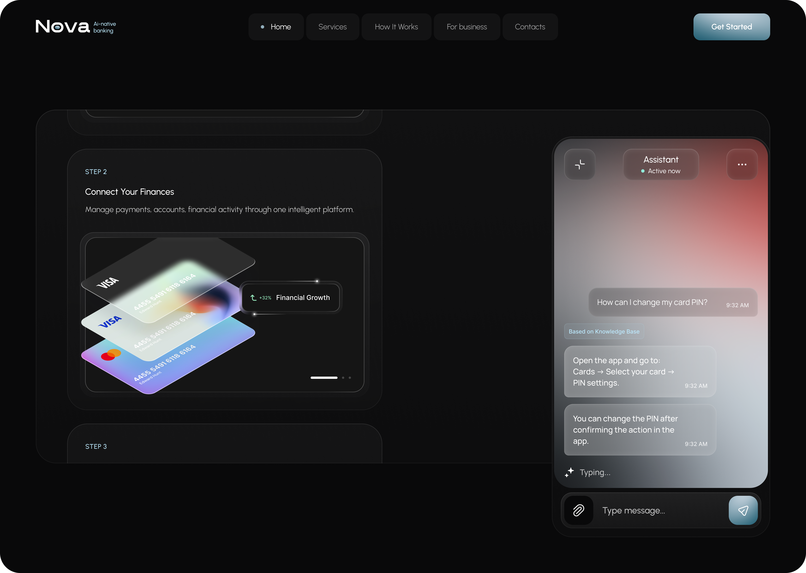
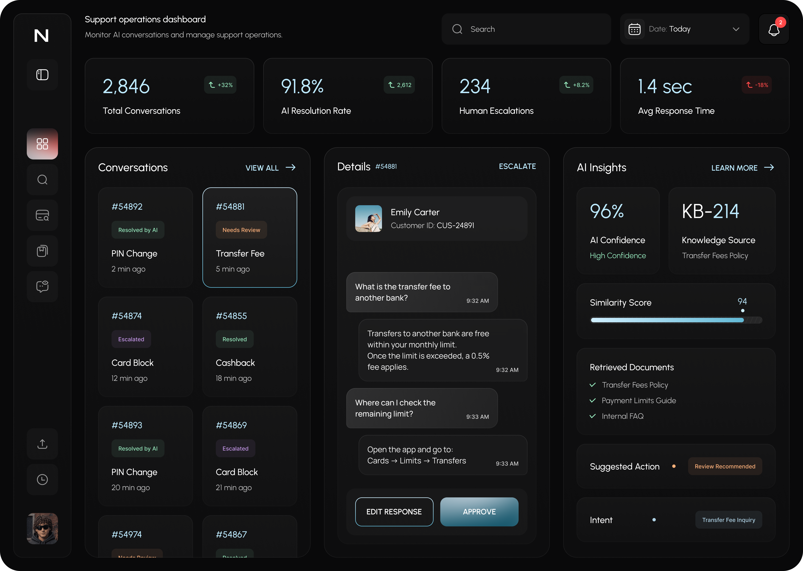
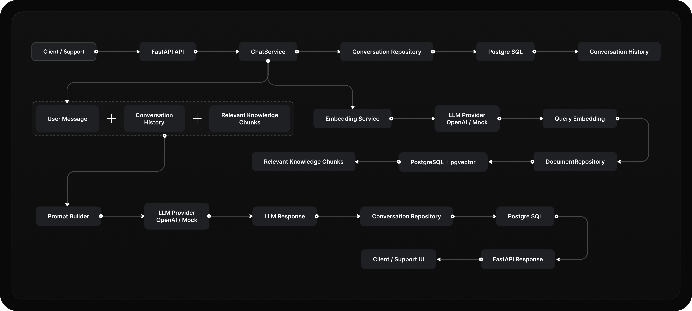

<div align="center">

# AI Support Platform

**RAG-powered backend for AI-assisted customer support**

A Dockerized FastAPI platform that combines conversation history,
semantic knowledge-base search, and pluggable LLM providers.


[](https://github.com/nalyvaiko-denys/ai-support-platform/actions/workflows/ci.yml)

</div>

---

## Project overview

> Product design concept. The repository implements the backend represented by
> this overview, not the website shown in the visual.



AI Support Platform is a backend-first system for AI-assisted customer support.
It retrieves relevant information from a knowledge base, combines it with the
current user message and conversation history, generates a response through the
configured LLM provider, and stores the conversation in PostgreSQL.

The platform supports two modes:

- **Mock mode** — deterministic local and CI execution without an API key;
- **OpenAI mode** — real embeddings and responses through the OpenAI API.

The product screens in this README are UI/UX concepts. This repository contains
the implemented backend API, RAG pipeline, database layer, Docker environment,
automated tests, and CI workflow.

---

## Client experience

> Product design concept. The frontend shown below is not implemented in this
> repository.



The client-facing assistant demonstrates how the backend can be integrated into
a banking website or another digital product.

The implemented API supports support questions, knowledge-based responses, and
conversation history. Human handoff remains part of the product concept.

---

## Support operations

> Product design concept. Operator controls, confidence metrics, approval flows,
> and escalation management are not implemented in the current backend.



The support dashboard demonstrates a possible human-in-the-loop workflow for
AI-assisted customer service.

Routine questions can be handled automatically, while complex requests can be
reviewed by a support specialist. The concept includes conversation monitoring,
review actions, retrieved knowledge sources, and escalation controls.

---

## System architecture



The diagram presents the high-level request flow implemented by the platform:
conversation-history retrieval, query embedding, semantic knowledge-base
search, prompt construction, LLM response generation, and conversation
persistence.

### Request flow

1. The client sends a message to the FastAPI endpoint.
2. Pydantic validates the session identifier and request body.
3. `ChatService` loads recent conversation history from PostgreSQL.
4. `EmbeddingService` creates an embedding for the user query.
5. `DocumentRepository` searches PostgreSQL and pgvector for relevant chunks.
6. `PromptBuilder` combines the message, history, and retrieved context.
7. The configured LLM provider generates a response.
8. The conversation and model metadata are stored in PostgreSQL.
9. FastAPI returns the response to the client.

---

## Implemented capabilities

- Asynchronous REST API built with FastAPI
- Strict request validation with Pydantic
- Conversation history stored in PostgreSQL
- Knowledge-base ingestion from Markdown
- Safe text chunking with configurable overlap
- Embedding generation through a provider abstraction
- Embedding metadata tracking across provider and model changes
- Similarity filtering and HNSW vector search with PostgreSQL and pgvector
- Context-aware prompt construction
- OpenAI and deterministic mock providers
- Idempotent knowledge-base ingestion
- Alembic database migrations
- Separate liveness and database readiness checks
- Docker Compose orchestration and hardened application containers
- Global handling of upstream OpenAI errors
- Ruff static analysis
- Automated pytest suite
- GitHub Actions quality and Docker smoke checks

---

## Technology stack

| Area | Technology | Project version/configuration |
|---|---|---|
| Language | Python | 3.13.14 |
| API | FastAPI | 0.139.2 |
| ASGI server | Uvicorn | 0.51.0 |
| Validation | Pydantic | 2.13.4 |
| ORM | SQLAlchemy | 2.0.51 |
| Database | PostgreSQL | 17 |
| Vector support | pgvector | 0.5.0 |
| Migrations | Alembic | 1.18.5 |
| LLM | OpenAI | GPT-4.1-mini |
| Embeddings | OpenAI | text-embedding-3-small |
| OpenAI SDK | `openai` | 2.48.0 |
| PostgreSQL driver | asyncpg | 0.31.0 |
| Dependency management | uv | 0.11.32 with `uv.lock` |
| Containers | Docker | Docker Compose |
| Testing | pytest | pytest, pytest-asyncio, pytest-cov |
| Code quality | Ruff | configured in `pyproject.toml` |
| CI | GitHub Actions | quality and end-to-end Docker smoke jobs |

---

## Quick start

### Requirements

Only Docker and Docker Compose are required for the default mock mode.

### Start the platform

```bash
docker compose up -d --build --wait
```

Check service status:

```bash
docker compose ps -a
```

Expected state:

```text
api       Up (healthy)
db        Up (healthy)
migrate   Exited (0)
```

The migration container is expected to exit with code `0` after applying all
pending Alembic migrations.

### API documentation

- Swagger UI: `http://localhost:8000/docs`
- ReDoc: `http://localhost:8000/redoc`
- OpenAPI schema: `http://localhost:8000/openapi.json`

### Stop the platform

```bash
docker compose down
```

Remove containers and the local PostgreSQL volume:

```bash
docker compose down -v --remove-orphans
```

---

## LLM providers

### Mock mode

Mock mode is enabled by default:

```env
LLM_PROVIDER=mock
```

It does not require an OpenAI API key and does not send external AI requests.
It is used for local development, automated tests, and Docker smoke checks.

Mock mode validates the API, dependency injection, database persistence, and
Docker orchestration. It is not intended to reproduce the semantic quality of
real OpenAI embeddings or generated answers.

### OpenAI mode

Create a local environment file:

```bash
cp .env.example .env
```

Configure:

```env
LLM_PROVIDER=openai
OPENAI_API_KEY=your_api_key
```

Rebuild and start the platform:

```bash
docker compose up -d --build --wait
```

OpenAI mode uses:

- `gpt-4.1-mini` for response generation;
- `text-embedding-3-small` for 1,536-dimensional embeddings.

Retrieval defaults can be adjusted without changing the database schema:

```env
RETRIEVAL_MIN_SIMILARITY=0.25
RETRIEVAL_LIMIT=3
```

OpenAI mode can generate API usage and associated costs. Never commit `.env` or
API credentials.

---

## Knowledge-base ingestion

Run ingestion inside Docker:

```bash
docker compose run --rm api python -m scripts.ingest
```

The source file is:

```text
data/bank_faq.md
```

Ingestion is idempotent. It tracks the content hash, embedding provider, model,
and dimension for every chunk. A provider or model change regenerates the stored
embeddings even when the source text has not changed.

Running ingestion again without changing the source or embedding profile returns:

```text
Knowledge base is already up to date.
```

The included knowledge base is a demonstration dataset and is not official
banking documentation.

---

## API

### Health check

```http
GET /api/health
```

This endpoint reports whether the API process is running.

### Readiness check

```http
GET /api/ready
```

This endpoint verifies that the API can reach PostgreSQL. Docker uses it as the
application container health check.

### Database connectivity check

```http
GET /api/db
```

### Send a message

```http
POST /api/{session_id}
Content-Type: application/json
```

Request:

```json
{
  "message": "How can I change my card PIN?"
}
```

Example:

```bash
curl \
  --request POST \
  --url http://localhost:8000/api/demo-session \
  --header "Content-Type: application/json" \
  --data '{"message":"How can I change my card PIN?"}'
```

### Retrieve conversation history

```http
GET /api/{session_id}/history
```

Session identifiers:

- may contain letters, numbers, underscores, and hyphens;
- must contain between 1 and 64 characters.

Messages are stripped of surrounding whitespace and limited to 4,000
characters. Unexpected request fields are rejected.

---

## Local development

Install the exact locked dependencies:

```bash
uv sync --locked --all-groups
```

Run static analysis:

```bash
uv run --locked ruff check .
```

Check formatting:

```bash
uv run --locked ruff format --check .
```

Run the test suite:

```bash
uv run --locked python -m pytest -q
```

Run tests with coverage:

```bash
uv run --locked python -m pytest \
  --cov=app \
  --cov-report=term-missing
```

Run the API without Docker:

```bash
uv run --locked uvicorn app.main:app --reload
```

A reachable PostgreSQL database and a valid `DATABASE_URL` are required for
local non-Docker execution.

---

## Project structure

```text
.
├── .github
│   └── workflows          # GitHub Actions CI
├── app
│   ├── api                # FastAPI routes
│   ├── core               # Settings and exception handlers
│   ├── db                 # SQLAlchemy engine and sessions
│   ├── dependencies       # Dependency injection
│   ├── llm                # Providers, prompts, and chunker
│   ├── models             # SQLAlchemy models
│   ├── repositories       # Database access layer
│   ├── schemas            # Pydantic schemas
│   └── services           # Application business logic
├── data                   # Demonstration knowledge base
├── docker                 # Application Dockerfile
├── docs
│   └── assets             # README product visuals
├── migrations             # Alembic migrations
├── scripts                # Knowledge-base ingestion command
├── tests                  # Unit and API tests
├── docker-compose.yml
├── LICENSE
├── pyproject.toml
└── uv.lock
```

---

## Current scope

This repository implements the backend platform.

The project overview, client assistant, and support operations dashboard are
product design concepts that demonstrate possible integrations with the API.
The support dashboard is not implemented as a frontend application in this
repository.

Potential production extensions include authentication, authorization, rate
limiting, observability, source citations, and a real human-escalation workflow.

---

## Disclaimer

This is an independent educational portfolio project.

The included sample knowledge base may be incomplete or outdated and
must not be treated as official financial guidance.

The source code is available under the terms of the [MIT License](LICENSE).
